## Cargar librerias

``` r
library(ggplot2)
library(agricolae)
library(ggbreak)
```

    ## ggbreak v0.1.4 Learn more at https://yulab-smu.top/

    ## If you use ggbreak in published research, please cite the following
    ## paper:
    ## 
    ## S Xu, M Chen, T Feng, L Zhan, L Zhou, G Yu. Use ggbreak to effectively
    ## utilize plotting space to deal with large datasets and outliers.
    ## Frontiers in Genetics. 2021, 12:774846. doi: 10.3389/fgene.2021.774846

``` r
library(readxl)
#library(ecodados)
library(visdat)
library(tidyverse)
```

    ## ── Attaching core tidyverse packages ──────────────────────── tidyverse 2.0.0 ──
    ## ✔ dplyr     1.1.4     ✔ readr     2.1.5
    ## ✔ forcats   1.0.0     ✔ stringr   1.5.1
    ## ✔ lubridate 1.9.4     ✔ tibble    3.2.1
    ## ✔ purrr     1.0.2     ✔ tidyr     1.3.1

    ## ── Conflicts ────────────────────────────────────────── tidyverse_conflicts() ──
    ## ✖ dplyr::filter() masks stats::filter()
    ## ✖ dplyr::lag()    masks stats::lag()
    ## ℹ Use the conflicted package (<http://conflicted.r-lib.org/>) to force all conflicts to become errors

``` r
library(lattice)
library(RVAideMemoire)
```

    ## *** Package RVAideMemoire v 0.9-83-7 ***

``` r
library(DHARMa)
```

    ## This is DHARMa 0.4.7. For overview type '?DHARMa'. For recent changes, type news(package = 'DHARMa')

``` r
library(performance)
library(MuMIn)
library(piecewiseSEM)
```

    ## 
    ##   This is piecewiseSEM version 2.3.0.1.
    ## 
    ## 
    ##   Questions or bugs can be addressed to <jslefche@gmail.com>.

``` r
library(MASS)
```

    ## 
    ## Adjuntando el paquete: 'MASS'
    ## 
    ## The following object is masked from 'package:dplyr':
    ## 
    ##     select

``` r
library(ggExtra)
library(Rmisc)
```

    ## Cargando paquete requerido: plyr
    ## ------------------------------------------------------------------------------
    ## You have loaded plyr after dplyr - this is likely to cause problems.
    ## If you need functions from both plyr and dplyr, please load plyr first, then dplyr:
    ## library(plyr); library(dplyr)
    ## ------------------------------------------------------------------------------
    ## 
    ## Adjuntando el paquete: 'plyr'
    ## 
    ## The following objects are masked from 'package:dplyr':
    ## 
    ##     arrange, count, desc, failwith, id, mutate, rename, summarise,
    ##     summarize
    ## 
    ## The following object is masked from 'package:purrr':
    ## 
    ##     compact

``` r
library(emmeans) 
```

    ## Welcome to emmeans.
    ## Caution: You lose important information if you filter this package's results.
    ## See '? untidy'

``` r
library(sjPlot)
library(bbmle)
```

    ## Cargando paquete requerido: stats4
    ## 
    ## Adjuntando el paquete: 'bbmle'
    ## 
    ## The following object is masked from 'package:MuMIn':
    ## 
    ##     AICc
    ## 
    ## The following object is masked from 'package:dplyr':
    ## 
    ##     slice

``` r
library(glmmTMB)
library(ordinal)
```

    ## 
    ## Adjuntando el paquete: 'ordinal'
    ## 
    ## The following object is masked from 'package:bbmle':
    ## 
    ##     slice
    ## 
    ## The following object is masked from 'package:dplyr':
    ## 
    ##     slice

``` r
library(car)
```

    ## Cargando paquete requerido: carData
    ## 
    ## Adjuntando el paquete: 'car'
    ## 
    ## The following object is masked from 'package:dplyr':
    ## 
    ##     recode
    ## 
    ## The following object is masked from 'package:purrr':
    ## 
    ##     some

``` r
library(ecolottery)
```

    ## 
    ## Adjuntando el paquete: 'ecolottery'
    ## 
    ## The following object is masked from 'package:dplyr':
    ## 
    ##     pick

``` r
library(naniar)
library(vcd)
```

    ## Cargando paquete requerido: grid

``` r
library(generalhoslem)
```

    ## Cargando paquete requerido: reshape
    ## 
    ## Adjuntando el paquete: 'reshape'
    ## 
    ## The following objects are masked from 'package:plyr':
    ## 
    ##     rename, round_any
    ## 
    ## The following object is masked from 'package:lubridate':
    ## 
    ##     stamp
    ## 
    ## The following object is masked from 'package:dplyr':
    ## 
    ##     rename
    ## 
    ## The following objects are masked from 'package:tidyr':
    ## 
    ##     expand, smiths

# Cargar Datos

``` r
hplc<-data.frame(read_excel("C:/Users/User/Documents/Documentos_Tesis/Estadistica/Factorial_simple_2.xlsx"))
attach(hplc)
head(hplc)
```

    ##   Chakra Edades Condiciones_luz    CGA
    ## 1      A     T0               -  5.688
    ## 2      A     T0               -  5.447
    ## 3      A     T0               -  5.447
    ## 4      A     T0               + 12.568
    ## 5      A     T0               + 11.955
    ## 6      A     T0               + 13.158

``` r
hplc$CGA
```

    ##  [1]  5.688  5.447  5.447 12.568 11.955 13.158  3.618  3.953  3.953  5.055
    ## [11]  5.251  5.251  2.475  2.579  2.579  1.803  1.749  1.749  7.333  7.189
    ## [21]  7.333 10.113 10.085  9.517  5.361  5.821  5.613  4.531  4.840  4.840
    ## [31] 10.191 10.322 10.279  2.620  2.600  2.473  2.443  2.460  2.413  3.593
    ## [41]  3.416  3.543  2.763  2.889  2.827  1.949  1.842  1.863  2.017  2.022
    ## [51]  2.013  1.391  1.430  1.352

``` r
Age<-factor(hplc$Edades)
chak<-factor(hplc$Chakra)
Light<-factor(hplc$Condiciones_luz)
```

# Analisis de Datos (en busca de normlaidad)

``` r
#Paso 1 buscar normalidad (Gauss)

dis<-lm(hplc$CGA~chak+Age*Light)
summary(aov(dis))
```

    ##             Df Sum Sq Mean Sq F value   Pr(>F)    
    ## chak         2 178.55   89.27   27.45 1.42e-08 ***
    ## Age          2 122.47   61.23   18.83 1.06e-06 ***
    ## Light        1   0.23    0.23    0.07    0.792    
    ## Age:Light    2  98.90   49.45   15.21 8.53e-06 ***
    ## Residuals   46 149.60    3.25                     
    ## ---
    ## Signif. codes:  0 '***' 0.001 '**' 0.01 '*' 0.05 '.' 0.1 ' ' 1

### Paso 1.2 Graficos de varianza

``` r
dca=aov((dis))
names(dca)
```

    ##  [1] "coefficients"  "residuals"     "effects"       "rank"         
    ##  [5] "fitted.values" "assign"        "qr"            "df.residual"  
    ##  [9] "contrasts"     "xlevels"       "call"          "terms"        
    ## [13] "model"

``` r
summary(dca)
```

    ##             Df Sum Sq Mean Sq F value   Pr(>F)    
    ## chak         2 178.55   89.27   27.45 1.42e-08 ***
    ## Age          2 122.47   61.23   18.83 1.06e-06 ***
    ## Light        1   0.23    0.23    0.07    0.792    
    ## Age:Light    2  98.90   49.45   15.21 8.53e-06 ***
    ## Residuals   46 149.60    3.25                     
    ## ---
    ## Signif. codes:  0 '***' 0.001 '**' 0.01 '*' 0.05 '.' 0.1 ' ' 1

``` r
fit<-aov(CGA~chak+Age*Light,data = hplc)
fit1<-as.data.frame.list(summary(fit))
knitr::kable(
  fit1, 
  caption = "Tabla 3: ANOVA"
)
```

|           |  Df |    Sum.Sq |   Mean.Sq |    F.value |    Pr..F. |
|:----------|----:|----------:|----------:|-----------:|----------:|
| chak      |   2 | 178.54994 | 89.274972 | 27.4506508 | 0.0000000 |
| Age       |   2 | 122.46697 | 61.233485 | 18.8283342 | 0.0000011 |
| Light     |   1 |   0.22802 |  0.228020 |  0.0701126 | 0.7923558 |
| Age:Light |   2 |  98.89684 | 49.448421 | 15.2046121 | 0.0000085 |
| Residuals |  46 | 149.60114 |  3.252199 |         NA |        NA |

Tabla 3: ANOVA

``` r
par(mfrow=c(1,1))
plot(dca)
```

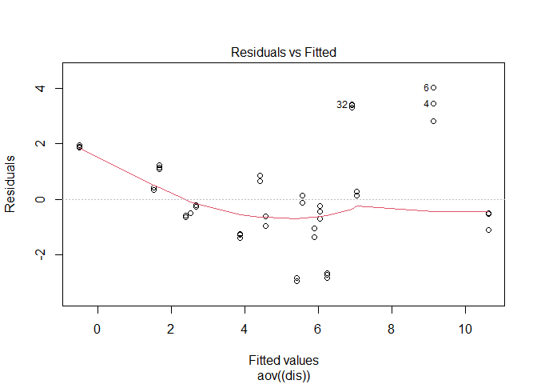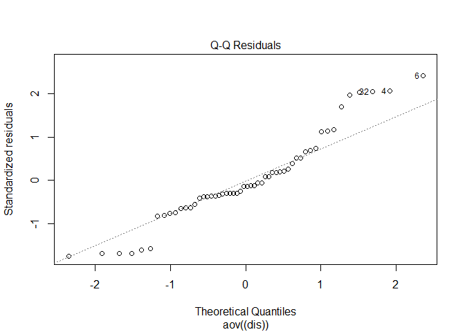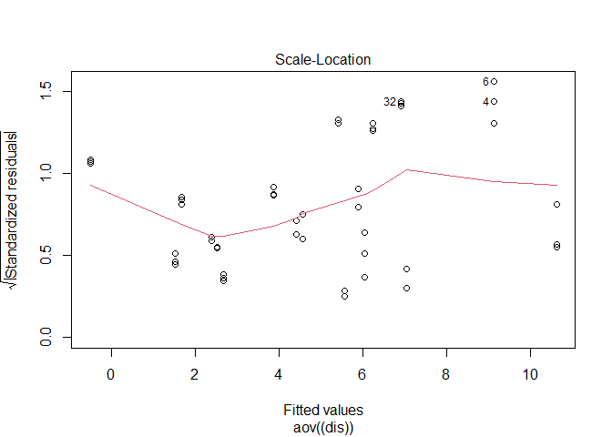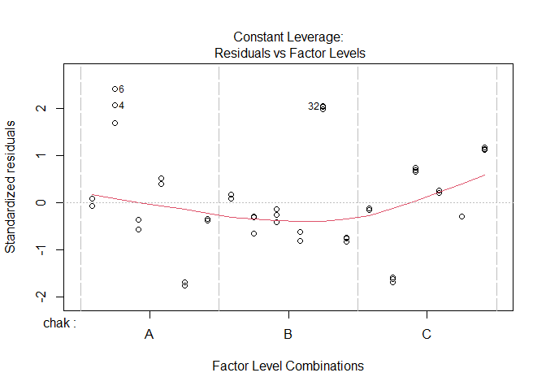

``` r
library(agricolae)
Grupos<- LSD.test(y = dca, trt = "CGA", group = T, console = T)
```

    ## Name:  CGA 
    ##  chak Age Light

``` r
Grupos<- LSD.test(y = dca, trt = "CGA", group = F, console = T)
```

    ## Name:  CGA 
    ##  chak Age Light

``` r
library(car)
qqPlot(dis, main = "Gráfico QQ de Residuos", id.method = "identify")
```

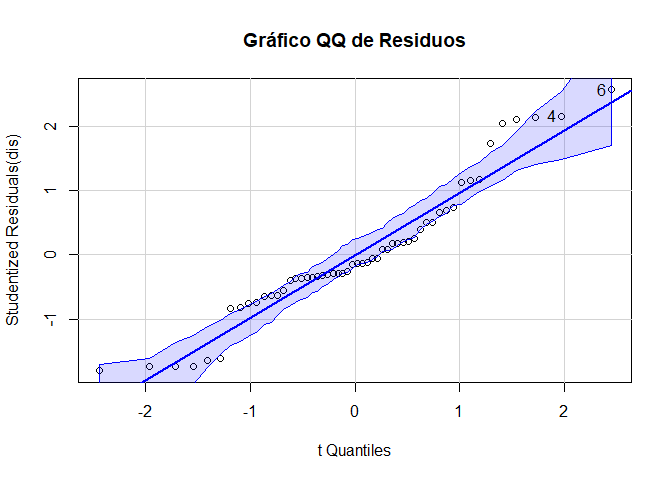

    ## [1] 4 6

``` r
aov(formula = CGA~chak+Age*Light,data = hplc)
```

    ## Call:
    ##    aov(formula = CGA ~ chak + Age * Light, data = hplc)
    ## 
    ## Terms:
    ##                      chak       Age     Light Age:Light Residuals
    ## Sum of Squares  178.54994 122.46697   0.22802  98.89684 149.60114
    ## Deg. of Freedom         2         2         1         2        46
    ## 
    ## Residual standard error: 1.803385
    ## Estimated effects may be unbalanced

### Shapiro

``` r
Residuos <-residuals(dca)
shapiro.test(Residuos)
```

    ## 
    ##  Shapiro-Wilk normality test
    ## 
    ## data:  Residuos
    ## W = 0.94037, p-value = 0.009657

Concluimos por graficos que los datos no presentan una normalidad se
propone realizar modelos lineales generalizados

# Modelos lineales generalizados

``` r
#Paquetes necesarios
#install.packages("pander")
library(pander)
```

## Modelos lineales generalizados-GAMMA

#### Gamma link=identity ; reff=Chak “A”

``` r
chak<-relevel(chak,ref="A")
dis2<-glm(hplc$CGA~chak+Age*Light,family=Gamma(link="identity"))
summary(dis2)
```

    ## 
    ## Call:
    ## glm(formula = hplc$CGA ~ chak + Age * Light, family = Gamma(link = "identity"))
    ## 
    ## Coefficients:
    ##              Estimate Std. Error t value Pr(>|t|)    
    ## (Intercept)    4.5232     0.5510   8.209 1.46e-10 ***
    ## chakB          2.0903     0.6018   3.474 0.001130 ** 
    ## chakC         -1.4928     0.3659  -4.080 0.000177 ***
    ## AgeT1         -0.4174     0.6450  -0.647 0.520779    
    ## AgeT2         -0.7854     0.6126  -1.282 0.206268    
    ## Light+         3.4508     1.0444   3.304 0.001851 ** 
    ## AgeT1:Light+  -3.8187     1.1896  -3.210 0.002421 ** 
    ## AgeT2:Light+  -4.5794     1.1317  -4.047 0.000197 ***
    ## ---
    ## Signif. codes:  0 '***' 0.001 '**' 0.01 '*' 0.05 '.' 0.1 ' ' 1
    ## 
    ## (Dispersion parameter for Gamma family taken to be 0.1267033)
    ## 
    ##     Null deviance: 22.262  on 53  degrees of freedom
    ## Residual deviance:  5.661  on 46  degrees of freedom
    ## AIC: 196.86
    ## 
    ## Number of Fisher Scoring iterations: 11

# Supuestos

``` r
## Residuos vs valores ajsutados "glm"
plot(dis2$fitted.values, resid(dis2, type = "response"),
     xlab = "Valores Ajustados", ylab = "Residuos",
     main = "Gráfico de Residuos vs Valores Ajustados")
  abline(h = 0, col = "red")
```

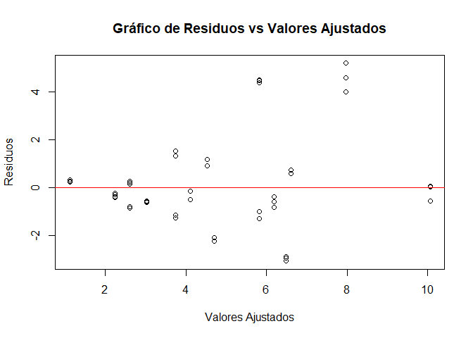

El grafico sugiere qie el mdoelo se ajusta RAZONABLEMENTE, existe el
problema de posibles outliers y una posible heterocedasticidad leve.

#### Se buscara modelos para verificar estos posibles problemas

``` r
# Instalar y cargar el paquete lmtest para la prueba de Breusch-Pagan para heterocedasticidad
#install.packages("lmtest")
library(lmtest)
```

    ## Cargando paquete requerido: zoo

    ## 
    ## Adjuntando el paquete: 'zoo'

    ## The following objects are masked from 'package:base':
    ## 
    ##     as.Date, as.Date.numeric

### Realizar la prueba de Breusch-Pagan

``` r
bptest(dis2)
```

    ## 
    ##  studentized Breusch-Pagan test
    ## 
    ## data:  dis2
    ## BP = 27.313, df = 7, p-value = 0.0002927

Se tiene un P_value bajo por lo que se propone que los datos tienen
hetocedasticidad

### Realizar la prueba de Durbin-Watson para la Autocorrelación

``` r
durbinWatsonTest(dis2)
```

    ##  lag Autocorrelation D-W Statistic p-value
    ##    1       0.6117208     0.7596207       0
    ##  Alternative hypothesis: rho != 0

El modelo propone que los datos tienen Autocorrelación por los tanto se
propone Tranformar los datos

### Instalar y cargar el paquete MASS para la transformación Box-Cox

``` r
#install.packages("MASS")
library(MASS)
```

### Realizar la transformación Box-Cox

``` r
boxcox(dis2)
```

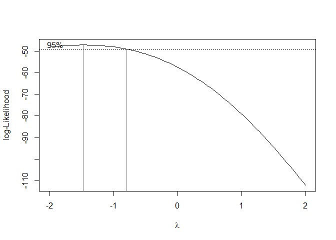

Se procedera a aplicar la Transformación Logarítmica, dado que el
intervalo de confianza incluye el 0, aplicar una transformación
logarítmica a la variable de respuesta podría ayudar a estabilizar la
varianza y mejorar la normalidad de los residuos.

### Convertir a logaritmo

``` r
hplc$CGA_transformed <- ifelse(hplc$CGA <= 0, log(hplc$CGA + 1), log(hplc$CGA))
```

### Ajusta el nuevo modelo GLM con la variable de respuesta transformada

``` r
modelo_glm_transformed <- glm(CGA_transformed ~ chak+Age*Light, family = Gamma(link = "log"), data = hplc)
```

### Verifica el resumen del modelo

``` r
summary(modelo_glm_transformed)
```

    ## 
    ## Call:
    ## glm(formula = CGA_transformed ~ chak + Age * Light, family = Gamma(link = "log"), 
    ##     data = hplc)
    ## 
    ## Coefficients:
    ##              Estimate Std. Error t value Pr(>|t|)    
    ## (Intercept)   0.47087    0.06935   6.790 1.89e-08 ***
    ## chakB         0.27529    0.06006   4.584 3.50e-05 ***
    ## chakC        -0.57663    0.06006  -9.601 1.46e-12 ***
    ## AgeT1        -0.06505    0.08494  -0.766 0.447703    
    ## AgeT2        -0.19548    0.08494  -2.302 0.025942 *  
    ## Light+        0.30371    0.08494   3.576 0.000835 ***
    ## AgeT1:Light+ -0.43341    0.12012  -3.608 0.000757 ***
    ## AgeT2:Light+ -1.05124    0.12012  -8.752 2.37e-11 ***
    ## ---
    ## Signif. codes:  0 '***' 0.001 '**' 0.01 '*' 0.05 '.' 0.1 ' ' 1
    ## 
    ## (Dispersion parameter for Gamma family taken to be 0.03246434)
    ## 
    ##     Null deviance: 14.0706  on 53  degrees of freedom
    ## Residual deviance:  1.4713  on 46  degrees of freedom
    ## AIC: -4.2309
    ## 
    ## Number of Fisher Scoring iterations: 6

# Supuestos

### Realizar predicciones con el modelo transformado

``` r
predicciones_log <- predict(modelo_glm_transformed, type = "response")
```

### Analizar supuestos

``` r
valores_reales_log <- log(hplc$CGA)
```

### Calculando MSE y MAE en la escala logarítmica

``` r
mse_log <- mean((valores_reales_log - predicciones_log)^2)
print(paste("MSE en escala logarítmica:", mse_log))
```

    ## [1] "MSE en escala logarítmica: 0.0713946242161535"

``` r
mae_log <- mean(abs(valores_reales_log - predicciones_log))
print(paste("MAE en escala logarítmica:", mae_log))
```

    ## [1] "MAE en escala logarítmica: 0.202216025255582"

### Convertir las predicciones de vuelta a la escala original

``` r
predicciones_original <- exp(predicciones_log)
```

### Calculando MSE y MAE en la escala original

``` r
mse_original <- mean((hplc$CGA - predicciones_original)^2)
mae_original <- mean(abs(hplc$CGA - predicciones_original))

print(paste("MSE en escala original:", mse_original))
```

    ## [1] "MSE en escala original: 5.64000014505826"

``` r
print(paste("MAE en escala original:", mae_original))
```

    ## [1] "MAE en escala original: 1.36888218676482"

## Linealidad

### Gráfico de dispersión para ‘Chak’

``` r
library(ggplot2)
ggplot(hplc, aes(x = chak, y = CGA_transformed)) +
  geom_point() +
  geom_smooth(method = "lm", se = FALSE) +
  labs(title = "Relación entre Chak y la variable de respuesta transformada(CGA)")
```

    ## `geom_smooth()` using formula = 'y ~ x'

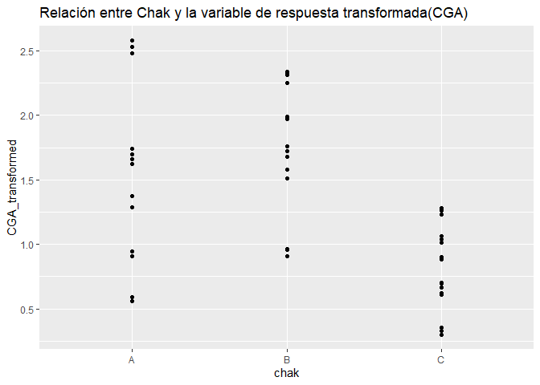

### Gráfico de dispersión para ‘Light’

``` r
ggplot(hplc, aes(x = Light, y = CGA_transformed)) +
  geom_point() +
  geom_smooth(method = "lm", se = FALSE) +
  labs(title = "Relación entre Light y la variable de respuesta transformada(CGA)")
```

    ## `geom_smooth()` using formula = 'y ~ x'

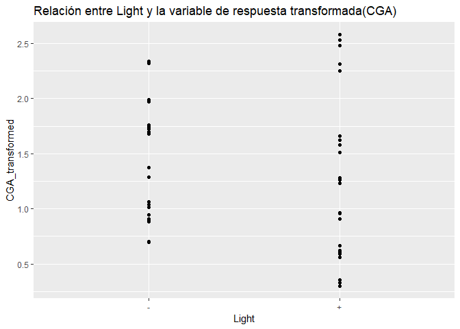

### Gráfico de dispersión para ‘Age’

``` r
ggplot(hplc, aes(x = Age, y = CGA_transformed)) +
  geom_point() +
  geom_smooth(method = "lm", se = FALSE) +
  labs(title = "Relación entre Age y la variable de respuesta transformada(CGA)")
```

    ## `geom_smooth()` using formula = 'y ~ x'

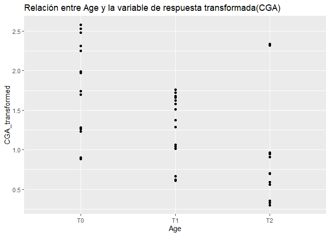

### Independencia

``` r
residuos1 <- resid(modelo_glm_transformed)
plot(residuos1, type = "l")
```

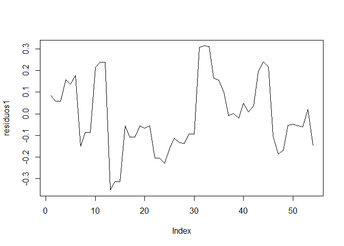

## Homocedasticidad

### Gráfico de residuos vs valores ajustados

``` r
plot(predict(modelo_glm_transformed), residuos1)
abline(h = 0, col = "red")
```

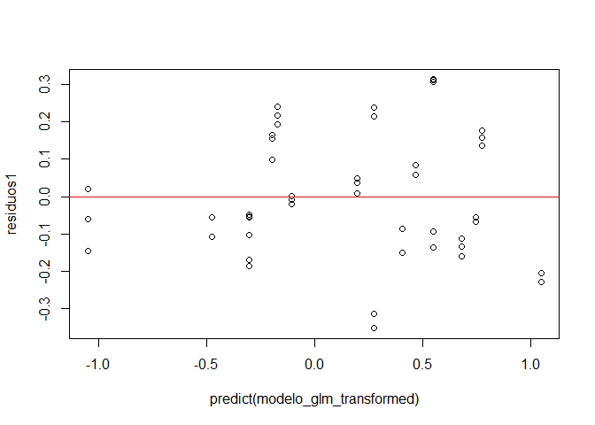

## Normalidad de los residuos

### QQ-plot de los residuos

``` r
qqnorm(residuos1)
qqline(residuos1, col = "red")
```

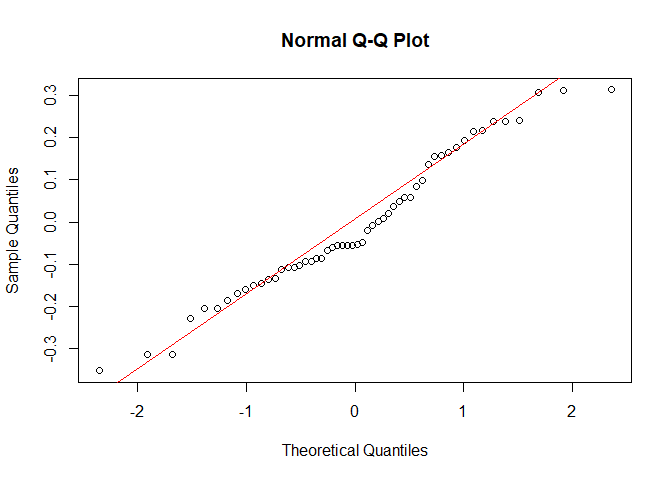

## Ausencia de multicolinealidad

### Para verificar la multicolinealidad

``` r
library(car)
vif(modelo_glm_transformed)
```

    ## there are higher-order terms (interactions) in this model
    ## consider setting type = 'predictor'; see ?vif

    ##           GVIF Df GVIF^(1/(2*Df))
    ## chak         1  2        1.000000
    ## Age          4  2        1.414214
    ## Light        3  1        1.732051
    ## Age:Light    8  2        1.681793

# Interpretación General

Linealidad: Dado que se esta trabajando con variables categóricas, la
“linealidad” no es el enfoque, sino más bien si las diferencias entre
las categorías son estadísticamente significativas.

Independencia: No parece haber patrones claros que sugieran problemas de
independencia.

Homocedasticidad: No hay señales evidentes de heterocedasticidad, aunque
una inspección visual no siempre es suficiente para descartarla.

Normalidad: Los residuos parecen ser aproximadamente normales con
algunas posibles desviaciones en los extremos.

Multicolinealidad: No hay indicaciones de multicolinealidad problemática
en el modelo.

# Reajuste del modelo

``` r
modelo_glm_retransformed <- glm(CGA_transformed ~ chak+Age*Light, family = Gamma(), data = hplc)
summary(modelo_glm_retransformed)
```

    ## 
    ## Call:
    ## glm(formula = CGA_transformed ~ chak + Age * Light, family = Gamma(), 
    ##     data = hplc)
    ## 
    ## Coefficients:
    ##              Estimate Std. Error t value Pr(>|t|)    
    ## (Intercept)   0.60721    0.05507  11.027 1.66e-14 ***
    ## chakB        -0.11974    0.04501  -2.660   0.0107 *  
    ## chakC         0.51836    0.07405   7.000 9.11e-09 ***
    ## AgeT1         0.07019    0.07114   0.987   0.3289    
    ## AgeT2         0.09431    0.07266   1.298   0.2008    
    ## Light+       -0.14336    0.05881  -2.437   0.0187 *  
    ## AgeT1:Light+  0.19126    0.09774   1.957   0.0565 .  
    ## AgeT2:Light+  0.98093    0.14657   6.692 2.64e-08 ***
    ## ---
    ## Signif. codes:  0 '***' 0.001 '**' 0.01 '*' 0.05 '.' 0.1 ' ' 1
    ## 
    ## (Dispersion parameter for Gamma family taken to be 0.0516666)
    ## 
    ##     Null deviance: 14.0706  on 53  degrees of freedom
    ## Residual deviance:  2.4433  on 46  degrees of freedom
    ## AIC: 23.32
    ## 
    ## Number of Fisher Scoring iterations: 5

# Validacion del modelo

``` r
# Instalar y cargar el paquete 'caret' para la validación cruzada
#install.packages("caret")
library(caret)

#Ver datos para ajustar a la validacion del modelo
print(names(hplc))
```

    ## [1] "Chakra"          "Edades"          "Condiciones_luz" "CGA"            
    ## [5] "CGA_transformed"

``` r
print(sum(is.na(hplc$CGA_transformed)))
```

    ## [1] 0

``` r
print(sum(is.na(hplc$chak)))
```

    ## [1] 0

``` r
print(sum(is.na(hplc$Age)))
```

    ## [1] 0

``` r
print(sum(is.na(hplc$Light)))
```

    ## [1] 0

``` r
hplc$Chakra <- factor(hplc$Chakra)
hplc$Edades <- factor(hplc$Edades)
hplc$Condiciones_luz <- factor(hplc$Condiciones_luz)
```

## Configuración de la validación cruzada

``` r
control <- trainControl(method = "cv", number = 10)
```

## Entrenamiento del modelo con validación cruzada

``` r
set.seed(123) # Para reproducibilidad
modelo_cv <- train(CGA_transformed ~ Chakra + Edades * Condiciones_luz, data = hplc, method = "glm", trControl = control)
```

# Resumen del modelo con validación cruzada

``` r
print(modelo_cv)
```

    ## Generalized Linear Model 
    ## 
    ## 54 samples
    ##  3 predictor
    ## 
    ## No pre-processing
    ## Resampling: Cross-Validated (10 fold) 
    ## Summary of sample sizes: 47, 50, 49, 50, 48, 50, ... 
    ## Resampling results:
    ## 
    ##   RMSE       Rsquared   MAE      
    ##   0.2887011  0.8323972  0.2380516

Estos resultados sugieren que el modelo tiene un buen ajuste estadístico
en términos de la capacidad para explicar la variabilidad de los datos y
que los errores de predicción son relativamente bajos.

# Gráfico de diagnóstico

``` r
par(mfrow = c(2, 2))
plot(modelo_glm_retransformed)
```

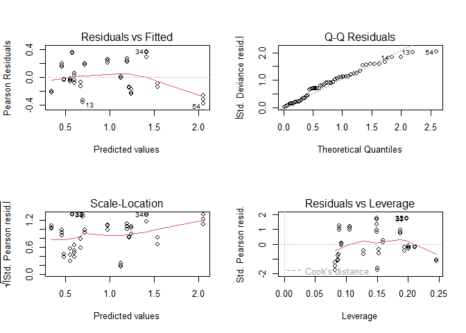

## Diagnostico de influencia

### Calculando la distancia de Cook

``` r
cooksd <- cooks.distance(modelo_glm_retransformed)
```

### Identificar puntos influyentes

``` r
plot(cooksd, pch = "*", cex = 2, main = "Distancia de Cook")
abline(h = 4/(nrow(df)-length(coef(modelo_glm_retransformed))), col = "red")
```


## Predicciones

### Hacer predicciones en la escala logarítmica

``` r
predicciones_log <- predict(modelo_glm_retransformed, newdata = hplc, type = "response")
```

### Retransformar las predicciones a la escala original

``` r
hplc$Predicciones_CGA <- exp(predicciones_log)
```

### Plot

``` r
head(hplc)
```

    ##   Chakra Edades Condiciones_luz    CGA CGA_transformed Predicciones_CGA
    ## 1      A     T0               -  5.688        1.738359         5.190683
    ## 2      A     T0               -  5.447        1.695065         5.190683
    ## 3      A     T0               -  5.447        1.695065         5.190683
    ## 4      A     T0               + 12.568        2.531154         8.635060
    ## 5      A     T0               + 11.955        2.481150         8.635060
    ## 6      A     T0               + 13.158        2.577030         8.635060

``` r
library(ggplot2)
#chack
ggplot(hplc, aes(x = CGA, y = Predicciones_CGA)) +
  geom_point() +
  geom_abline(intercept = 0, slope = 1, linetype = "dashed", color = "red") +
  labs(x = "Valores Observados de CGA", y = "Valores Predichos de CGA", title = "Comparación de Valores Observados y Predichos") +
  theme_minimal()
```

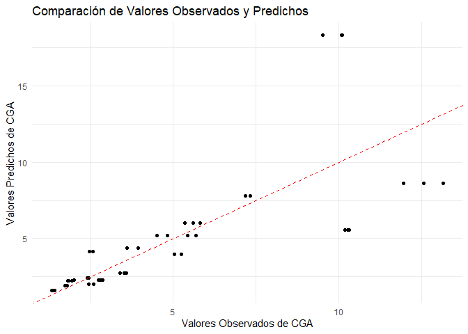

Parece que el modelo hace un buen trabajo al predecir CGA, especialmente
para valores más bajos de CGA. Si hay un patrón en los errores de
predicción a medida que aumenta CGA.

# ANOVA

## Realizar un ANOVA

``` r
modelo_anova <- aov(CGA_transformed ~chak+Age*Light, data = hplc)
summary(modelo_anova)
```

    ##             Df Sum Sq Mean Sq F value   Pr(>F)    
    ## chak         2  9.184   4.592   63.30 6.18e-14 ***
    ## Age          2  5.939   2.970   40.94 6.13e-11 ***
    ## Light        1  0.136   0.136    1.87    0.178    
    ## Age:Light    2  3.271   1.636   22.55 1.50e-07 ***
    ## Residuals   46  3.337   0.073                     
    ## ---
    ## Signif. codes:  0 '***' 0.001 '**' 0.01 '*' 0.05 '.' 0.1 ' ' 1

# Tukey

### chak

``` r
tukey_results <- TukeyHSD(modelo_anova, "chak")
print(tukey_results)
```

    ##   Tukey multiple comparisons of means
    ##     95% family-wise confidence level
    ## 
    ## Fit: aov(formula = CGA_transformed ~ chak + Age * Light, data = hplc)
    ## 
    ## $chak
    ##           diff        lwr        upr     p adj
    ## B-A  0.3487368  0.1313065  0.5661672 0.0009366
    ## C-A -0.6466886 -0.8641190 -0.4292582 0.0000000
    ## C-B -0.9954254 -1.2128558 -0.7779951 0.0000000

Estos resultados sugieren que hay diferencias significativas en la
variable de respuesta transformada entre los distintos niveles de
chakra. Específicamente, el grupo C tiene una media significativamente
menor que los grupos A y B, y el grupo B tiene una media
significativamente mayor que el grupo A.

## Age

``` r
tukey_results2 <- TukeyHSD(modelo_anova, "Age")
print(tukey_results2)
```

    ##   Tukey multiple comparisons of means
    ##     95% family-wise confidence level
    ## 
    ## Fit: aov(formula = CGA_transformed ~ chak + Age * Light, data = hplc)
    ## 
    ## $Age
    ##             diff        lwr        upr     p adj
    ## T1-T0 -0.4544677 -0.6718981 -0.2370374 0.0000210
    ## T2-T0 -0.8103661 -1.0277965 -0.5929358 0.0000000
    ## T2-T1 -0.3558984 -0.5733288 -0.1384681 0.0007331

Para Age, cada uno de los tiempos posteriores (T1 y T2) tiene una media
significativamente menor en la variable de respuesta transformada en
comparación con el tiempo base T0. Además, T2 es significativamente
menor que T1.

light: No es estadisticamente significativo

# Plot tukey

## chak

#### Primero, creamos un dataframe con los resultados de la prueba de Tukey para ‘chak’

``` r
tukey_chak <- data.frame(
  group = c("B-A", "C-A", "C-B"),
  diff = c(0.3487368, -0.6466886, -0.9954254),
  lwr = c(0.1313065, -0.8641190, -1.2128558),
  upr = c(0.5661672, -0.4292582, -0.7779951)
)
```

``` r
# Ahora, creamos el gráfico de barra con ggplot2
library(ggplot2)

chak_plot <- ggplot(hplc, aes(x = Chakra, y = CGA_transformed)) +
  geom_boxplot(fill = "#A1D99B", colour = "#00B050") +
  labs(title = "Distribution of CGA_transformed Chakra", x = "Chakra", y = "CGA_transformed") +
  theme(plot.title = element_text(size = 15))
# Save plot
ggsave(filename = "E:/Paper/Diseño_factorial_imagenes/Chak.pdf", plot = chak_plot,
       width = 6, height = 5, units = "in", dpi = 300, scale = 1.7)
ggsave(filename = "E:/Paper/Diseño_factorial_imagenes/Chak.png", plot = chak_plot,
       width = 6, height = 5, units = "in", dpi = 300, scale = 1.7)
chak_plot
```

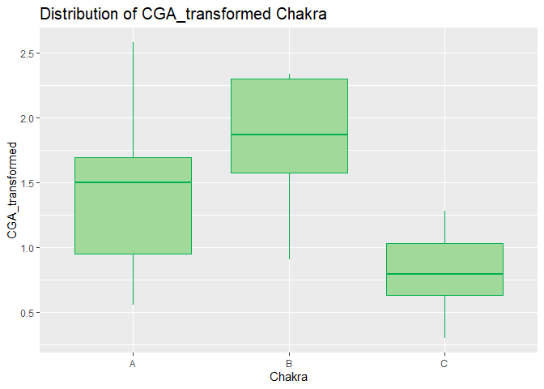

## Age

``` r
# Creamos un dataframe con los resultados de la prueba de Tukey para 'Age'
tukey_age <- data.frame(
  group = c("T1-T0", "T2-T0", "T2-T1"),
  diff = c(-0.4544677, -0.8103661, -0.3558984),
  lwr = c(-0.6718981, -1.0277965, -0.5733288),
  upr = c(-0.2370374, -0.5929358, -0.1384681)
)

# Creamos el gráfico de barra para 'Age'
ages_plot <-ggplot(hplc, aes(x = Edades, y = CGA_transformed)) +
  geom_boxplot(fill = "#A1D99B", colour = "#00B050") +
  labs(title = "Distribution of CGA_transformed for ages", x = "Ages", y = "CGA_transformed") +
  theme(plot.title = element_text(size = 15))

# Save plot
ggsave(filename = "E:/Paper/Diseño_factorial_imagenes/Ages.pdf", plot = ages_plot,
       width = 6, height = 5, units = "in", dpi = 300, scale = 1.7)
ggsave(filename = "E:/Paper/Diseño_factorial_imagenes/Ages.png", plot = ages_plot,
       width = 6, height = 5, units = "in", dpi = 300, scale = 1.7)
ages_plot
```

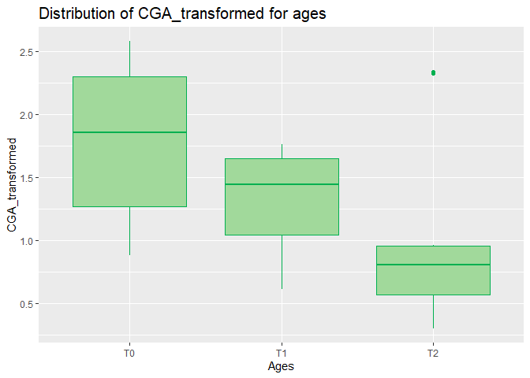

## Creamos el gráfico de barra para ‘Light’

``` r
light_plot <-ggplot(hplc, aes(x = Light, y = CGA_transformed)) +
  geom_boxplot(fill = "#A1D99B", colour = "#00B050") +
  labs(title = "Distribution of CGA_transformed by Light", x = "Shadow/Light", y = "CGA_transformed") +
  theme(plot.title = element_text(size = 15))

# Save plot
ggsave(filename = "E:/Paper/Diseño_factorial_imagenes/light.pdf", plot = light_plot,
       width = 6, height = 5, units = "in", dpi = 300, scale = 1.7)
ggsave(filename = "E:/Paper/Diseño_factorial_imagenes/light.png", plot = light_plot,
       width = 6, height = 5, units = "in", dpi = 300, scale = 1.7)
light_plot
```

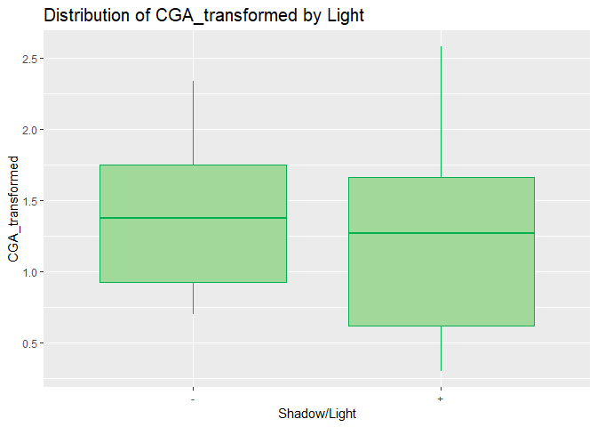

# FIN

# Tabla de Medias con emmeans (Modelo Ajustado):

``` r
library(emmeans)
# Usar los mismos nombres que en el modelo (chak, Age, Light)
medias_em <- emmeans(modelo_glm_retransformed, ~ chak + Age + Light)
tabla_em <- as.data.frame(medias_em)

# Formatear
knitr::kable(tabla_em,
  caption = "Medias Ajustadas por el Modelo GLM",
  digits = 3
)
```

| chak | Age | Light | emmean |    SE |  df | lower.CL | upper.CL |
|:-----|:----|:------|-------:|------:|----:|---------:|---------:|
| A    | T0  | \-    |  0.607 | 0.055 |  46 |    0.496 |    0.718 |
| B    | T0  | \-    |  0.487 | 0.051 |  46 |    0.385 |    0.590 |
| C    | T0  | \-    |  1.126 | 0.078 |  46 |    0.969 |    1.282 |
| A    | T1  | \-    |  0.677 | 0.060 |  46 |    0.556 |    0.798 |
| B    | T1  | \-    |  0.558 | 0.057 |  46 |    0.444 |    0.672 |
| C    | T1  | \-    |  1.196 | 0.081 |  46 |    1.033 |    1.359 |
| A    | T2  | \-    |  0.702 | 0.062 |  46 |    0.577 |    0.826 |
| B    | T2  | \-    |  0.582 | 0.059 |  46 |    0.464 |    0.700 |
| C    | T2  | \-    |  1.220 | 0.082 |  46 |    1.055 |    1.385 |
| A    | T0  | \+    |  0.464 | 0.046 |  46 |    0.372 |    0.556 |
| B    | T0  | \+    |  0.344 | 0.039 |  46 |    0.266 |    0.422 |
| C    | T0  | \+    |  0.982 | 0.073 |  46 |    0.836 |    1.129 |
| A    | T1  | \+    |  0.725 | 0.064 |  46 |    0.597 |    0.853 |
| B    | T1  | \+    |  0.606 | 0.061 |  46 |    0.484 |    0.728 |
| C    | T1  | \+    |  1.244 | 0.083 |  46 |    1.076 |    1.411 |
| A    | T2  | \+    |  1.539 | 0.125 |  46 |    1.287 |    1.792 |
| B    | T2  | \+    |  1.419 | 0.125 |  46 |    1.169 |    1.670 |
| C    | T2  | \+    |  2.057 | 0.134 |  46 |    1.788 |    2.327 |

Medias Ajustadas por el Modelo GLM

# Tabla de Medias con Errores Estándar (para publicación):

``` r
rm(sd)  # Elimina el data.frame llamado "sd"
```

    ## Warning in rm(sd): objeto 'sd' no encontrado

``` r
# Deben devolver "function"
class(mean)
```

    ## [1] "function"

``` r
class(sd)
```

    ## [1] "function"

``` r
class(length)
```

    ## [1] "function"

``` r
# Calcular media, error estándar y tamaño de muestra
media <- aggregate(CGA ~ chak + Age + Light, data = hplc, FUN = mean)
sd <- aggregate(CGA ~ chak + Age + Light, data = hplc, FUN = sd)  # Ahora usa la función correcta
n <- aggregate(CGA ~ chak + Age + Light, data = hplc, FUN = length)

# Combinar y formatear
tabla_final <- Reduce(
  function(x, y) merge(x, y, by = c("chak", "Age", "Light")),
  list(media, sd, n)
)
colnames(tabla_final) <- c("Chakra", "Edad", "Luz", "Media", "SD", "n")
tabla_final$SE <- tabla_final$SD / sqrt(tabla_final$n)
tabla_final$`Media ± SE` <- sprintf("%.2f ± %.2f", tabla_final$Media, tabla_final$SE)

# Mostrar tabla
knitr::kable(
  tabla_final[, c("Chakra", "Edad", "Luz", "Media ± SE", "n")],
  caption = "Medias Aritméticas con Error Estándar (Datos Originales)"
)
```

| Chakra | Edad | Luz | Media ± SE   |   n |
|:-------|:-----|:----|:-------------|----:|
| A      | T0   | \-  | 5.53 ± 0.08  |   3 |
| A      | T0   | \+  | 12.56 ± 0.35 |   3 |
| A      | T1   | \-  | 3.84 ± 0.11  |   3 |
| A      | T1   | \+  | 5.19 ± 0.07  |   3 |
| A      | T2   | \-  | 2.54 ± 0.03  |   3 |
| A      | T2   | \+  | 1.77 ± 0.02  |   3 |
| B      | T0   | \-  | 7.29 ± 0.05  |   3 |
| B      | T0   | \+  | 9.90 ± 0.19  |   3 |
| B      | T1   | \-  | 5.60 ± 0.13  |   3 |
| B      | T1   | \+  | 4.74 ± 0.10  |   3 |
| B      | T2   | \-  | 10.26 ± 0.04 |   3 |
| B      | T2   | \+  | 2.56 ± 0.05  |   3 |
| C      | T0   | \-  | 2.44 ± 0.01  |   3 |
| C      | T0   | \+  | 3.52 ± 0.05  |   3 |
| C      | T1   | \-  | 2.83 ± 0.04  |   3 |
| C      | T1   | \+  | 1.88 ± 0.03  |   3 |
| C      | T2   | \-  | 2.02 ± 0.00  |   3 |
| C      | T2   | \+  | 1.39 ± 0.02  |   3 |

Medias Aritméticas con Error Estándar (Datos Originales)
