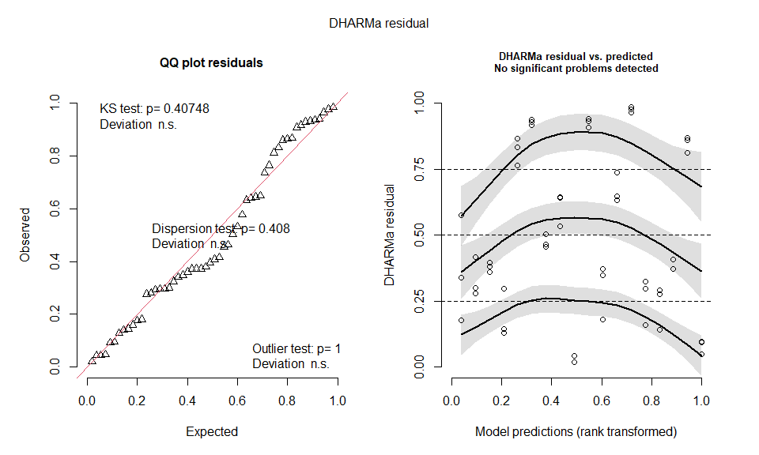
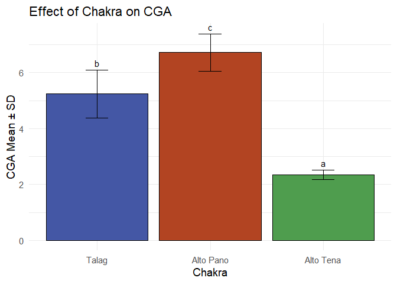
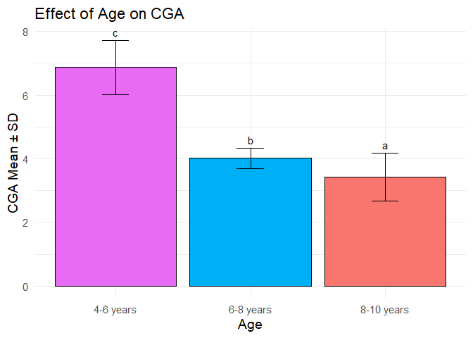
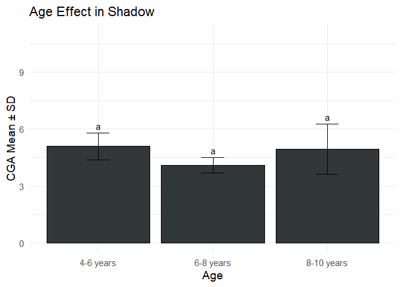
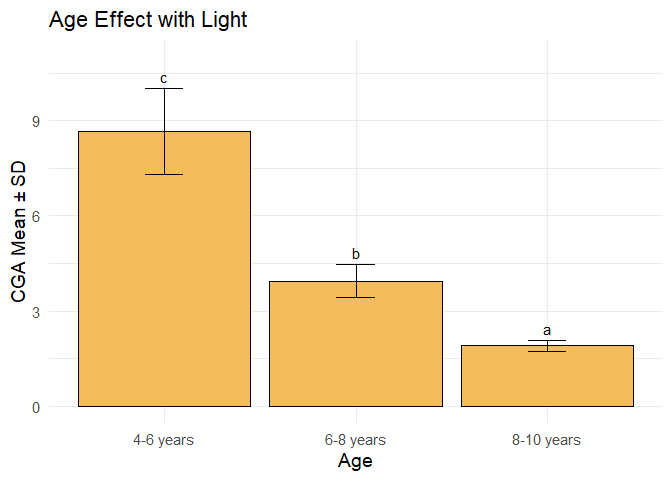
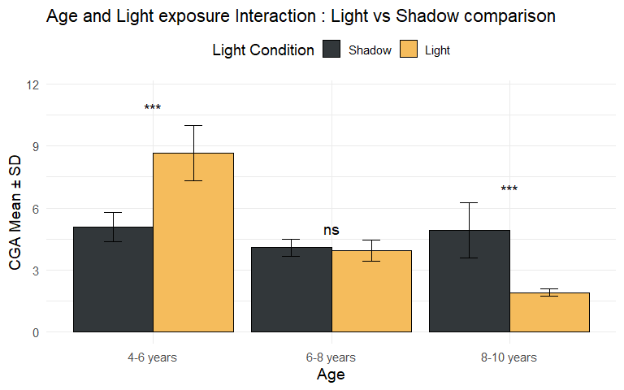

# Configuración inicial

    # --- CONFIGURACIÓN INICIAL ---
    # Este chunk realiza la configuración inicial: limpia el entorno, carga paquetes y establece opciones

    # Limpiar entorno (opcional pero recomendado para comenzar desde cero)
    #rm(list = ls())

    # Cargar librerías con conflicto controlado
    library(readr)     # Lectura eficiente de datos
    library(ggplot2)   # Visualizaciones avanzadas
    library(emmeans)   # Medias marginales y comparaciones post-hoc
    library(multcomp)  # Letras de significancia
    library(multcompView) # Visualización de comparaciones múltiples
    library(knitr)     # Reportes reproducibles y tablas formateadas
    library(tibble)    # Dataframes mejorados
    library(car)       # Análisis de varianza y supuestos
    library(DHARMa)    # Diagnóstico de modelos mixtos
    library(dplyr)     # Manipulación de datos (cargar al final para evitar conflictos)

# Carga y preparación de datos

    # --- 1. CARGA Y PREPARACIÓN DE DATOS ---
    # Este chunk carga los datos crudos y realiza la transformación inicial

    # Leer datos desde texto
    hplc <- readr::read_csv("C:/Users/User/Documents/Documentos_Tesis/Estadistica/Factorial_simple_2.csv")

    # Procesamiento inicial de datos
    hplc <- hplc %>%
      mutate(
        Chakra = factor(Chakra),
        Age = factor(Edades, levels = c("T0", "T1", "T2")), # Factor ordenado
        Light = factor(Condiciones_luz),
        logCGA = log(CGA)  # Transformación logarítmica
      ) %>%
      dplyr::select(Chakra, Age, Light, CGA, logCGA)

    # Inspección inicial de datos
    print(head(hplc))

    ## # A tibble: 6 × 5
    ##   Chakra Age   Light   CGA logCGA
    ##   <fct>  <fct> <fct> <dbl>  <dbl>
    ## 1 A      T0    -      5.69   1.74
    ## 2 A      T0    -      5.45   1.70
    ## 3 A      T0    -      5.45   1.70
    ## 4 A      T0    +     12.6    2.53
    ## 5 A      T0    +     12.0    2.48
    ## 6 A      T0    +     13.2    2.58

    print(str(hplc))

    ## tibble [54 × 5] (S3: tbl_df/tbl/data.frame)
    ##  $ Chakra: Factor w/ 3 levels "A","B","C": 1 1 1 1 1 1 1 1 1 1 ...
    ##  $ Age   : Factor w/ 3 levels "T0","T1","T2": 1 1 1 1 1 1 2 2 2 2 ...
    ##  $ Light : Factor w/ 2 levels "-","+": 1 1 1 2 2 2 1 1 1 2 ...
    ##  $ CGA   : num [1:54] 5.69 5.45 5.45 12.57 11.96 ...
    ##  $ logCGA: num [1:54] 1.74 1.7 1.7 2.53 2.48 ...
    ## NULL

    print(summary(hplc))

    ##  Chakra Age     Light       CGA             logCGA      
    ##  A:18   T0:18   -:27   Min.   : 1.352   Min.   :0.3016  
    ##  B:18   T1:18   +:27   1st Qu.: 2.447   1st Qu.:0.8950  
    ##  C:18   T2:18          Median : 3.606   Median :1.2825  
    ##                        Mean   : 4.770   Mean   :1.3562  
    ##                        3rd Qu.: 5.669   3rd Qu.:1.7350  
    ##                        Max.   :13.158   Max.   :2.5770

# Modelado estadístico

    # --- 2. AJUSTE DEL MODELO LINEAL GENERALIZADO (GLM) --->
    # Modelo final elegido basado en análisis previo: Gamma con enlace log para logCGA
    modelo_final_glm <- glm(logCGA ~ Chakra + Age * Light,
                            family = Gamma(link = "log"),
                            data = hplc)

    # Resumen del modelo ajustado
     print(summary(modelo_final_glm))

    ## 
    ## Call:
    ## glm(formula = logCGA ~ Chakra + Age * Light, family = Gamma(link = "log"), 
    ##     data = hplc)
    ## 
    ## Coefficients:
    ##              Estimate Std. Error t value Pr(>|t|)    
    ## (Intercept)   0.47087    0.06935   6.790 1.89e-08 ***
    ## ChakraB       0.27529    0.06006   4.584 3.50e-05 ***
    ## ChakraC      -0.57663    0.06006  -9.601 1.46e-12 ***
    ## AgeT1        -0.06505    0.08494  -0.766 0.447703    
    ## AgeT2        -0.19548    0.08494  -2.302 0.025942 *  
    ## Light+        0.30371    0.08494   3.576 0.000835 ***
    ## AgeT1:Light+ -0.43341    0.12012  -3.608 0.000757 ***
    ## AgeT2:Light+ -1.05124    0.12012  -8.752 2.37e-11 ***
    ## ---
    ## Signif. codes:  0 '***' 0.001 '**' 0.01 '*' 0.05 '.' 0.1 ' ' 1
    ## 
    ## (Dispersion parameter for Gamma family taken to be 0.03246434)
    ## 
    ##     Null deviance: 14.0706  on 53  degrees of freedom
    ## Residual deviance:  1.4713  on 46  degrees of freedom
    ## AIC: -4.2309
    ## 
    ## Number of Fisher Scoring iterations: 6

    # Obtener tabla ANOVA del GLM (Tipo III)
     anova_results_glm <- car::Anova(modelo_final_glm, type = "III") # Especificar paquete car::
     print(anova_results_glm)

    ## Analysis of Deviance Table (Type III tests)
    ## 
    ## Response: logCGA
    ##           LR Chisq Df Pr(>Chisq)    
    ## Chakra     195.187  2  < 2.2e-16 ***
    ## Age          5.383  2  0.0677700 .  
    ## Light       12.726  1  0.0003606 ***
    ## Age:Light   76.479  2  < 2.2e-16 ***
    ## ---
    ## Signif. codes:  0 '***' 0.001 '**' 0.01 '*' 0.05 '.' 0.1 ' ' 1

# Validación de supuestos

    # --- 3. EVALUACIÓN DE SUPUESTOS DEL MODELO FINAL ---

    # Simular residuos escalados cuantílicos
    # Usar tryCatch para manejar posibles errores en la simulación misma
    simulationOutput <- tryCatch({
      DHARMa::simulateResiduals(fittedModel = modelo_final_glm, plot = FALSE) # Usar DHARMa:: explícitamente
    }, error = function(e) {
      message("Error al simular residuos DHARMa: ", e$message)
      return(NULL)
    })

    # --- 3.1. Tabla Resumen de Supuestos ---
    # Inicializar variables como character para evitar errores de tipo
    ks_stat_chr <- ks_pval_chr <- disp_stat_chr <- disp_pval_chr <- out_stat_chr <- out_pval_chr <- r2_chr <- "N/A"
    ks_interp <- disp_interp <- out_interp <- r2_interp <- "N/A" # Inicializar interpretación para R2 también

    # Proceder solo si la simulación DHARMa fue exitosa
    if (!is.null(simulationOutput)) {
      # Realizar pruebas específicas usando DHARMa:: explícitamente
      test_ks <- DHARMa::testUniformity(simulationOutput, plot = FALSE)
      test_disp <- DHARMa::testDispersion(simulationOutput, plot = FALSE)
      test_out <- DHARMa::testOutliers(simulationOutput, plot = FALSE)

      # Extraer valores numéricos primero
      ks_stat_val <- ifelse(is.numeric(test_ks$statistic), round(test_ks$statistic, 3), NA_real_)
      ks_pval_val <- ifelse(is.numeric(test_ks$p.value), round(test_ks$p.value, 3), NA_real_)
      disp_stat_raw <- test_disp$statistic # Puede no ser un único número
      disp_pval_val <- ifelse(is.numeric(test_disp$p.value), round(test_disp$p.value, 3), NA_real_)
      out_stat_raw <- test_out$statistic # Puede no ser un único número
      out_pval_val <- ifelse(is.numeric(test_out$p.value), round(test_out$p.value, 3), NA_real_)

      # Convertir a character para la tabla, manejando NA y posibles vectores
      ks_stat_chr <- ifelse(is.na(ks_stat_val), "NA", as.character(ks_stat_val))
      ks_pval_chr <- ifelse(is.na(ks_pval_val), "NA", as.character(ks_pval_val))
      disp_stat_chr <- ifelse(is.numeric(disp_stat_raw),
                              ifelse(is.na(disp_stat_raw), "NA", as.character(round(disp_stat_raw, 3))),
                              paste(disp_stat_raw, collapse=";")) # Maneja si no es numérico
      disp_pval_chr <- ifelse(is.na(disp_pval_val), "NA", as.character(disp_pval_val))
      out_stat_chr <- ifelse(is.numeric(out_stat_raw),
                             ifelse(is.na(out_stat_raw), "NA", as.character(round(out_stat_raw, 3))),
                             paste(out_stat_raw, collapse=";")) # Maneja si no es numérico
      out_pval_chr <- ifelse(is.na(out_pval_val), "NA", as.character(out_pval_val))

      # Interpretaciones basadas en valores numéricos antes de convertir a character
      ks_interp <- ifelse(is.na(ks_pval_val), "Error en test KS", ifelse(ks_pval_val < 0.05, "Desviación significativa", "OK"))
      disp_interp <- ifelse(is.na(disp_pval_val), "Error en test Dispersion", ifelse(disp_pval_val < 0.05, "Dispersión no constante/incorrecta", "OK"))
      out_interp <- ifelse(is.na(out_pval_val), "Error en test Outliers", ifelse(out_pval_val < 0.05, "Presencia de Outliers", "OK"))

    } else {
       # Asegurar tipo character si la simulación falló
       ks_stat_chr <- ks_pval_chr <- disp_stat_chr <- disp_pval_chr <- out_stat_chr <- out_pval_chr <- "Error Sim."
       # Also set interpretations to error state
       ks_interp <- disp_interp <- out_interp <- "Error en simulación DHARMa"
    }

    # --- Calcular Pseudo R-cuadrado ---
    pseudo_r2_results <- tryCatch({
        r2_perf <- performance::r2(modelo_final_glm)
        # Elegir un R2, por ejemplo Nagelkerke o Tjur si disponible
        if ("R2_Nagelkerke" %in% names(r2_perf)) {
            val <- round(r2_perf$R2_Nagelkerke, 3)
            method <- "Nagelkerke"
        } else if ("R2_Tjur" %in% names(r2_perf)) {
            val <- round(r2_perf$R2_Tjur, 3)
            method <- "Tjur"
        } else {
             # Fallback a la primera R2 disponible si las preferidas no están
             val <- round(r2_perf[[1]], 3)
             method <- names(r2_perf)[1]
        }
        # Asegurarse que val es numérico antes de convertir
        val_chr <- ifelse(is.na(val), "NA", as.character(val))
        list(value = val_chr, method = method, interp = "OK")
    }, error = function(e) {
        message("Error calculando Pseudo R2: ", e$message)
        list(value = "Error Calc.", method = "performance::r2", interp = "Error")
    })
    r2_chr <- pseudo_r2_results$value
    r2_method <- pseudo_r2_results$method
    r2_interp <- pseudo_r2_results$interp
    r2_pval_chr <- "NA" # R2 no tiene p-valor

    # --- Calcular VIF ---
    # Nota: VIF se calcula sobre un modelo aditivo para evaluar colinealidad entre predictores principales
    vif_values <- tryCatch({
      # Usar un modelo solo con efectos principales para VIF
      model_additive_for_vif <- update(modelo_final_glm, . ~ Chakra + Age + Light)
      vif_raw <- car::vif(model_additive_for_vif) # Especificar paquete car::
      # Asegurarse que vif_raw es un vector o matriz nombrada
      if (is.matrix(vif_raw)) { # Si hay múltiples columnas de VIF (e.g., gvif)
         vif_text <- paste(rownames(vif_raw), apply(round(vif_raw, 2), 1, paste, collapse=":"), sep=": ", collapse="; ")
      } else if (is.vector(vif_raw) && !is.null(names(vif_raw))) { # Vector nombrado estándar
         vif_text <- paste(names(vif_raw), round(vif_raw, 2), sep=": ", collapse="; ")
      } else {
         vif_text <- "Formato VIF no esperado"
      }
      vif_text
    }, error = function(e) {
      message("Error al calcular VIF: ", e$message)
      "Error al calcular VIF"
    })
    vif_interp <- ifelse(grepl("Error|no esperado", vif_values), "Error/No calculado", "VIFs bajos (<5) indican baja colinealidad")
    vif_pval_chr <- "NA" # VIF no tiene p-valor

    # --- Crear la tabla de supuestos ---
    assumption_summary <- tibble::tribble(
      ~Supuesto, ~Método, ~`Estadístico/Valor`, ~`p-valor`, ~Interpretación,
      # --- DHARMa tests ---
      "Distribución Residuos", "DHARMa KS test", ks_stat_chr, ks_pval_chr, ks_interp, # Ya es KS test
      "Homocedasticidad/Dispersión", "DHARMa testDispersion", disp_stat_chr, disp_pval_chr, disp_interp,
      "Outliers", "DHARMa testOutliers", out_stat_chr, out_pval_chr, out_interp,
      # --- Multicolinealidad ---
      "Multicolinealidad (VIF aditivo)", "car::vif", vif_values, vif_pval_chr, vif_interp,
      # --- Bondad de Ajuste (aproximada) ---
      "Pseudo R-cuadrado", paste0("performance::r2 (", r2_method, ")"), r2_chr, r2_pval_chr, r2_interp
    )

    # Mostrar tabla de supuestos

    # Usar kable para formatear la tabla
    print(knitr::kable(assumption_summary, caption = "Tabla de Supuestos del Modelo GLM Final (logCGA ~ Chakra + Age * Light, Gamma(log))"))

    ## 
    ## 
    ## Table: Tabla de Supuestos del Modelo GLM Final (logCGA ~ Chakra + Age * Light, Gamma(log))
    ## 
    ## |Supuesto                        |Método                       |Estadístico/Valor                       |p-valor |Interpretación                            |
    ## |:-------------------------------|:----------------------------|:---------------------------------------|:-------|:-----------------------------------------|
    ## |Distribución Residuos           |DHARMa KS test               |0.121                                   |0.407   |OK                                        |
    ## |Homocedasticidad/Dispersión     |DHARMa testDispersion        |1.215                                   |0.408   |OK                                        |
    ## |Outliers                        |DHARMa testOutliers          |0                                       |1       |OK                                        |
    ## |Multicolinealidad (VIF aditivo) |car::vif                     |Chakra: 1:2:1; Age: 1:2:1; Light: 1:1:1 |NA      |VIFs bajos (<5) indican baja colinealidad |
    ## |Pseudo R-cuadrado               |performance::r2 (Nagelkerke) |0.907                                   |NA      |OK                                        |

    # --- 3.2. Gráficos de Diagnóstico DHARMa ---
    # Esencial revisar estos gráficos visualmente además de la tabla
    # Proceder solo si la simulación fue exitosa
    if (!is.null(simulationOutput)) {
        plot(simulationOutput) # Esto genera el QQ-plot y el de Residuos vs Predichos
    } else {
        message("No se pueden generar gráficos DHARMa debido a error en la simulación.")
    }

# Análisis post-hoc

    # --- 4. ANÁLISIS POST-HOC ---
    # Usar emmeans sobre el modelo final para obtener medias y comparaciones
    # Nota: Las comparaciones se hacen sobre la escala del predictor (log-link en este caso)

    # --- 4.1. Efecto Principal: Chakra --->
    emm_chakra <- emmeans::emmeans(modelo_final_glm, ~ Chakra) # Usar emmeans::
    pairs_chakra <- pairs(emm_chakra, adjust = "tukey") # Ajuste Tukey para comparaciones
    cld_chakra <- multcomp::cld(emm_chakra, Letters = letters, alpha = 0.05, adjust = "tukey") # Usar multcomp::
     print("Comparaciones para Chakra:")

    ## [1] "Comparaciones para Chakra:"

     print(pairs_chakra)

    ##  contrast estimate     SE df t.ratio p.value
    ##  A - B      -0.275 0.0601 46  -4.584  0.0001
    ##  A - C       0.577 0.0601 46   9.601  <.0001
    ##  B - C       0.852 0.0601 46  14.185  <.0001
    ## 
    ## Results are averaged over the levels of: Age, Light 
    ## Results are given on the log (not the response) scale. 
    ## P value adjustment: tukey method for comparing a family of 3 estimates

     print(cld_chakra)

    ##  Chakra emmean     SE df lower.CL upper.CL .group
    ##  C      -0.288 0.0425 46   -0.393   -0.183  a    
    ##  A       0.288 0.0425 46    0.183    0.394   b   
    ##  B       0.564 0.0425 46    0.459    0.669    c  
    ## 
    ## Results are averaged over the levels of: Age, Light 
    ## Results are given on the log (not the response) scale. 
    ## Confidence level used: 0.95 
    ## Conf-level adjustment: sidak method for 3 estimates 
    ## P value adjustment: tukey method for comparing a family of 3 estimates 
    ## significance level used: alpha = 0.05 
    ## NOTE: If two or more means share the same grouping symbol,
    ##       then we cannot show them to be different.
    ##       But we also did not show them to be the same.

    # --- 4.2. Efecto Principal: Age --->
    # Advertencia: Interpretar con cautela debido a la interacción significativa
    emm_age <- emmeans::emmeans(modelo_final_glm, ~ Age)
    pairs_age <- pairs(emm_age, adjust = "tukey")
    cld_age <- multcomp::cld(emm_age, Letters = letters, alpha = 0.05, adjust = "tukey")
     print("Comparaciones para Age (promediado sobre Light - CUIDADO por interacción):")

    ## [1] "Comparaciones para Age (promediado sobre Light - CUIDADO por interacción):"

     print(pairs_age)

    ##  contrast estimate     SE df t.ratio p.value
    ##  T0 - T1     0.282 0.0601 46   4.691  0.0001
    ##  T0 - T2     0.721 0.0601 46  12.006  <.0001
    ##  T1 - T2     0.439 0.0601 46   7.315  <.0001
    ## 
    ## Results are averaged over the levels of: Chakra, Light 
    ## Results are given on the log (not the response) scale. 
    ## P value adjustment: tukey method for comparing a family of 3 estimates

     print(cld_age)

    ##  Age emmean     SE df lower.CL upper.CL .group
    ##  T2  -0.199 0.0425 46   -0.304  -0.0936  a    
    ##  T1   0.241 0.0425 46    0.135   0.3458   b   
    ##  T0   0.522 0.0425 46    0.417   0.6275    c  
    ## 
    ## Results are averaged over the levels of: Chakra, Light 
    ## Results are given on the log (not the response) scale. 
    ## Confidence level used: 0.95 
    ## Conf-level adjustment: sidak method for 3 estimates 
    ## P value adjustment: tukey method for comparing a family of 3 estimates 
    ## significance level used: alpha = 0.05 
    ## NOTE: If two or more means share the same grouping symbol,
    ##       then we cannot show them to be different.
    ##       But we also did not show them to be the same.

    # --- 4.3. Interacción: Age * Light --->
    # Comparar Age dentro de cada nivel de Light
    emm_age_light <- emmeans::emmeans(modelo_final_glm, ~ Age | Light)
    pairs_age_light <- pairs(emm_age_light, adjust = "sidak") # Sidak para 3 comps por grupo
    cld_age_light <- multcomp::cld(emm_age_light, Letters = letters, alpha = 0.05, adjust = "sidak")
     print("Comparaciones para Age dentro de Light:")

    ## [1] "Comparaciones para Age dentro de Light:"

     print(pairs_age_light)

    ## Light = -:
    ##  contrast estimate     SE df t.ratio p.value
    ##  T0 - T1     0.065 0.0849 46   0.766  0.8315
    ##  T0 - T2     0.195 0.0849 46   2.302  0.0758
    ##  T1 - T2     0.130 0.0849 46   1.536  0.3448
    ## 
    ## Light = +:
    ##  contrast estimate     SE df t.ratio p.value
    ##  T0 - T1     0.498 0.0849 46   5.869  <.0001
    ##  T0 - T2     1.247 0.0849 46  14.678  <.0001
    ##  T1 - T2     0.748 0.0849 46   8.810  <.0001
    ## 
    ## Results are averaged over the levels of: Chakra 
    ## Results are given on the log (not the response) scale. 
    ## P value adjustment: sidak method for 3 tests

     print(cld_age_light)

    ## Light = -:
    ##  Age emmean     SE df lower.CL upper.CL .group
    ##  T2   0.175 0.0601 46   0.0261    0.324  a    
    ##  T1   0.305 0.0601 46   0.1566    0.454  a    
    ##  T0   0.370 0.0601 46   0.2216    0.519  a    
    ## 
    ## Light = +:
    ##  Age emmean     SE df lower.CL upper.CL .group
    ##  T2  -0.573 0.0601 46  -0.7214   -0.424  a    
    ##  T1   0.176 0.0601 46   0.0269    0.324   b   
    ##  T0   0.674 0.0601 46   0.5253    0.823    c  
    ## 
    ## Results are averaged over the levels of: Chakra 
    ## Results are given on the log (not the response) scale. 
    ## Confidence level used: 0.95 
    ## Conf-level adjustment: sidak method for 3 estimates 
    ## P value adjustment: sidak method for 3 tests 
    ## significance level used: alpha = 0.05 
    ## NOTE: If two or more means share the same grouping symbol,
    ##       then we cannot show them to be different.
    ##       But we also did not show them to be the same.

    # O Comparar Light dentro de cada nivel de Age
    emm_light_age <- emmeans::emmeans(modelo_final_glm, ~ Light | Age)
    pairs_light_age <- pairs(emm_light_age, adjust = "sidak") # Ajuste para 3 comparaciones
     print("Comparaciones para Light dentro de Age:")

    ## [1] "Comparaciones para Light dentro de Age:"

     print(pairs_light_age)

    ## Age = T0:
    ##  contrast  estimate     SE df t.ratio p.value
    ##  (-) - (+)   -0.304 0.0849 46  -3.576  0.0008
    ## 
    ## Age = T1:
    ##  contrast  estimate     SE df t.ratio p.value
    ##  (-) - (+)    0.130 0.0849 46   1.527  0.1336
    ## 
    ## Age = T2:
    ##  contrast  estimate     SE df t.ratio p.value
    ##  (-) - (+)    0.748 0.0849 46   8.801  <.0001
    ## 
    ## Results are averaged over the levels of: Chakra 
    ## Results are given on the log (not the response) scale.

    # Crear símbolos de significancia para el gráfico t-test style
     signif_light_age <- as.data.frame(pairs_light_age) %>%
       dplyr::mutate(significance = case_when( # Usar dplyr::
                p.value <= 0.001 ~ "***",
                p.value <= 0.01  ~ "**",
                p.value <= 0.05  ~ "*",
                TRUE             ~ "ns" # No Significativo
              ))

# Visualización de resultados

    # --- 5. VISUALIZACIÓN DE RESULTADOS ---
    # Este chunk genera las figuras finales para el informe

    # --- 5.1. Preparación para Gráficos --->
    # *** FUNCIÓN AUXILIAR CORREGIDA (sin cambios respecto a la versión anterior) ***
    add_cld_letters <- function(summary_df, cld_object, group_vars) {
      # Convertir el objeto cld (puede ser emmGrid) a data.frame
      if (!is.data.frame(cld_object)) {
        cld_df <- as.data.frame(cld_object)
      } else {
        cld_df <- cld_object
      }

      # Verificar que las columnas de agrupación y .group existen en cld_df
      required_cols <- c(group_vars, ".group")
      if (!all(required_cols %in% names(cld_df))) {
        stop("Las columnas requeridas (", paste(required_cols, collapse=", "), ") no se encuentran todas en el objeto cld.")
      }

      # Limpiar espacios en blanco de las letras de grupo
      cld_df$.group <- trimws(cld_df$.group)

      # Seleccionar solo las columnas necesarias de cld_df
      # Usar all_of() para seguridad si group_vars viene de una variable externa
      cld_subset <- cld_df %>%
                      dplyr::select(all_of(group_vars), .group) # Usar dplyr::

      # Asegurarse que las columnas de unión sean del mismo tipo (factor es seguro)
      for (var in group_vars) {
          if (var %in% names(summary_df) && var %in% names(cld_subset)) {
              summary_df[[var]] <- as.factor(summary_df[[var]])
              cld_subset[[var]] <- as.factor(cld_subset[[var]])
          } else {
              stop(paste("La columna de agrupación", var, "no existe en summary_df o cld_subset."))
          }
      }

      # Unir los datos resumen con las letras CLD
      dplyr::left_join(summary_df, cld_subset, by = group_vars) # Usar dplyr::
    }

# Grafico chakra

    # --- 5.2. Gráfico: Efecto Principal Chakra --->

    # Calcular directamente sobre hplc agrupado solo por Chakra
    summary_chakra_direct <- hplc %>% dplyr::group_by(Chakra) %>% # Usar dplyr::
        # Usar dplyr::summarise explícitamente
        dplyr::summarise(mean_CGA = mean(CGA), sd_CGA = sd(CGA), N=n(), se_CGA = sd_CGA/sqrt(N), .groups='drop')

    # Añadir letras usando la función CORREGIDA
    summary_chakra_plot <- add_cld_letters(summary_chakra_direct, cld_chakra, "Chakra")

    # Verificar el resultado antes de graficar
    #print(summary_chakra_plot)

    # Definir colores manualmente (cambia los valores hex a tus colores deseados)
    colores_manual <- c("#4457A5FF", "#B24422FF","#4F9D4EFF")

    # Definir etiquetas personalizadas para el eje X (en el orden de tus niveles de Chakra)
    etiquetas_x <- c("Talag", "Alto Pano", "Alto Tena")

    plot_chakra <- ggplot2::ggplot(summary_chakra_plot, ggplot2::aes(x = Chakra, y = mean_CGA, fill = Chakra)) +
      ggplot2::geom_col(position = ggplot2::position_dodge(width = 0.9), color = "black") +
      ggplot2::geom_errorbar(ggplot2::aes(ymin = mean_CGA - se_CGA, ymax = mean_CGA + se_CGA),
                    width = 0.2, position = ggplot2::position_dodge(width = 0.9)) +
      ggplot2::geom_text(ggplot2::aes(label = .group, y = mean_CGA + se_CGA), vjust = -0.5, size = 4) +
      
      # Cambiar colores manualmente
      ggplot2::scale_fill_manual(values = colores_manual) +
      
      # Cambiar etiquetas del eje X
      ggplot2::scale_x_discrete(labels = etiquetas_x) +
      
      ggplot2::labs(title = "Effect of Chakra on CGA",
           x = "Chakra",
           y = "CGA Mean ± SD",
           fill = "Chakra") +
      ggplot2::theme_minimal(base_size = 14) +
      ggplot2::theme(legend.position = "none")

    print(plot_chakra)

    # Save plot
    ggsave(filename = "E:/Paper/Diseño_factorial_CGA/Chakra_CGA.pdf", plot = plot_chakra,
           width = 7, height = 5, units = "in", dpi = 300, scale = 1.7)
    ggsave(filename = "E:/Paper/Diseño_factorial_CGA/Chakra_CGA.png", plot = plot_chakra,
           width = 7, height = 5, units = "in", dpi = 300, scale = 1.7)

# Grafico de las edades

    # --- 6.1. Gráfico: Efecto Principal Age ---
    # Calcular resumen agrupando solo por Age
    summary_age_direct <- hplc %>%
      dplyr::group_by(Age) %>%
      dplyr::summarise(
        mean_CGA = mean(CGA, na.rm = TRUE),
        sd_CGA = sd(CGA, na.rm = TRUE),
        N = n(),
        se_CGA = sd_CGA / sqrt(N),
        .groups = 'drop'
       )

    # Añadir letras CLD (calculadas previamente en cld_age)
    # Nota: CLD se basa en logCGA, el gráfico muestra CGA. Interpretar con cautela.
    summary_age_plot <- add_cld_letters(summary_age_direct, cld_age, "Age")

    # Definir colores manualmente para Age (modifica los códigos hex)
    colores_manual_edad <- c("#E76BF3", "#00B0F6", "#F8766D")  # Debe coincidir con el número de niveles de Age

    # Definir etiquetas personalizadas para el eje X (en el orden de tus niveles de Age)
    etiquetas_x_edad <- c("4-6 years", "6-8 years", "8-10 years")  # Ejemplo en español, modifica según necesites

    plot_age <- ggplot2::ggplot(
        data = summary_age_plot,
        mapping = ggplot2::aes(x = Age, y = mean_CGA, fill = Age)
      ) +
      ggplot2::geom_col(
        position = ggplot2::position_dodge(width = 0.9), 
        color = "black",
        show.legend = FALSE
      ) +
      ggplot2::geom_errorbar(
        ggplot2::aes(ymin = mean_CGA - se_CGA, ymax = mean_CGA + se_CGA),
        width = 0.2,
        position = ggplot2::position_dodge(width = 0.9)
      ) +
      ggplot2::geom_text(
        ggplot2::aes(label = .group, y = mean_CGA + se_CGA),
        vjust = -0.5, 
        size = 4
      ) +
      # Aplicar personalizaciones
      ggplot2::scale_fill_manual(values = colores_manual_edad) +  # Colores manuales
      ggplot2::scale_x_discrete(labels = etiquetas_x_edad) +      # Etiquetas personalizadas en eje X
      ggplot2::labs(
        title = "Effect of Age on CGA",
        #subtitle = "(Promediado sobre Chakra y Light; CLD basado en logCGA)",
        x = "Age",
        y = "CGA Mean ± SD"
      ) +
      ggplot2::theme_minimal(base_size = 14)

    print(plot_age)

    # Save plot
    ggsave(filename = "E:/Paper/Diseño_factorial_CGA/Age_CGA.pdf", plot = plot_age,
           width = 7, height = 5, units = "in", dpi = 300, scale = 1.7)
    ggsave(filename = "E:/Paper/Diseño_factorial_CGA/Age_CGA.png", plot = plot_age,
           width = 7, height = 5, units = "in", dpi = 300, scale = 1.7)

# Grafico interaccion de la luz:edad

    # --- 6.3. Gráficos de Interacción Separados por Luz ---
    # *** PASO 1: Calcular medias y SE promediando sobre Chakra ***
    # Agrupar por Age y Light para obtener medias consistentes con las CLD
    summary_stats_avg <- hplc %>%
      dplyr::group_by(Age, Light) %>% # Usar dplyr::
      # Usar dplyr::summarise explícitamente
      dplyr::summarise(
        N = n(), # Nota: N aquí es el número de Chakras * réplicas por Chakra
        mean_CGA = mean(CGA, na.rm = TRUE),
        sd_CGA = sd(CGA, na.rm = TRUE),
        # Calcular SE sobre la media de las medias de Chakra o directamente sobre los datos
        # Aquí lo calculamos sobre todos los datos dentro de Age:Light
        se_CGA = sd_CGA / sqrt(N),
        .groups = 'drop' # Evita que siga agrupado
      )

    # *** PASO 2: Añadir letras CLD para la interacción (cld_age_light) ***
    # Necesitamos unir por Age y Light al data frame promediado
    summary_interaction_plot_avg <- add_cld_letters(summary_stats_avg, cld_age_light, c("Age", "Light"))

    # Usar summary_interaction_plot_avg que ya tiene las medias promediadas sobre Chakra
    # y las letras CLD para Age dentro de cada Light
    summary_dark <- summary_interaction_plot_avg %>% dplyr::filter(Light == "-")
    # Definir colores manuales para Age (oscuros/acordes a la temática de oscuridad)
    colores_oscuridad <- c("#32373AFF", "#32373AFF", "#32373AFF")  # 3 tonos de azul oscuro

    # Definir etiquetas personalizadas para el eje X (mismo orden que los niveles de Age)
    etiquetas_x_oscuridad <- c("4-6 years", "6-8 years", "8-10 years")  # Ejemplo

    plot_interaction_dark <- ggplot2::ggplot(
      summary_dark, 
      ggplot2::aes(x = Age, y = mean_CGA, fill = Age)  # Mapear fill a Age para usar colores manuales
    ) +
      ggplot2::geom_col(color = "black", show.legend = FALSE) +  # Quitamos el fill fijo
      ggplot2::geom_errorbar(
        ggplot2::aes(ymin = mean_CGA - se_CGA, ymax = mean_CGA + se_CGA),
        width = 0.2
      ) +
      ggplot2::geom_text(
        ggplot2::aes(label = .group, y = mean_CGA + se_CGA),
        vjust = -0.5, 
        size = 4
      ) +
      # Aplicar personalizaciones
      ggplot2::scale_fill_manual(values = colores_oscuridad) +  # Colores manuales
      ggplot2::scale_x_discrete(labels = etiquetas_x_oscuridad) +  # Etiquetas personalizadas
      ggplot2::labs(
        title = "Age Effect in Shadow",
        #subtitle = "Medias ± Error Estándar (promediado sobre Chakra)",
        x = "Age",
        y = "CGA Mean ± SD"
      ) +
      ggplot2::theme_minimal(base_size = 14) +
      ggplot2::coord_cartesian(
        ylim = c(0, max(summary_interaction_plot_avg$mean_CGA + 
                        summary_interaction_plot_avg$se_CGA) * 1.1)
      )

    print(plot_interaction_dark)

    # Save plot
    ggsave(filename = "E:/Paper/Diseño_factorial_CGA/Shadow_CGA.pdf", plot = plot_interaction_dark,
           width = 7, height = 5, units = "in", dpi = 300, scale = 1.7)
    ggsave(filename = "E:/Paper/Diseño_factorial_CGA/Shadow_CGA.png", plot = plot_interaction_dark,
           width = 7, height = 5, units = "in", dpi = 300, scale = 1.7)

    # Gráfico para Light = "+" (Luz)
    summary_light_cond <- summary_interaction_plot_avg %>% dplyr::filter(Light == "+")

    # Definir colores manuales para Age (tonos claros/acordes a la temática de luz)
    colores_luz <- c("#F5BC5CFF", "#F5BC5CFF", "#F5BC5CFF")

    # Definir etiquetas personalizadas para el eje X (mismo orden que los niveles de Age)
    etiquetas_x_luz <- c("4-6 years", "6-8 years", "8-10 years")  # Ejemplo en español

    plot_interaction_light <- ggplot2::ggplot(
      summary_light_cond, 
      ggplot2::aes(x = Age, y = mean_CGA, fill = Age)  # Mapear fill a Age
    ) +
      ggplot2::geom_col(color = "black", show.legend = FALSE) +  # Quitamos el fill fijo
      ggplot2::geom_errorbar(
        ggplot2::aes(ymin = mean_CGA - se_CGA, ymax = mean_CGA + se_CGA),
        width = 0.2
      ) +
      ggplot2::geom_text(
        ggplot2::aes(label = .group, y = mean_CGA + se_CGA),
        vjust = -0.5, 
        size = 4
      ) +
      # Aplicar personalizaciones
      ggplot2::scale_fill_manual(values = colores_luz) +  # Colores manuales
      ggplot2::scale_x_discrete(labels = etiquetas_x_luz) +  # Etiquetas personalizadas
      ggplot2::labs(
        title = "Age Effect with Light",
        #subtitle = "Medias ± Error Estándar (promediado sobre Chakra)",
        x = "Age",
        y = "CGA Mean ± SD"
      ) +
      ggplot2::theme_minimal(base_size = 14) +
      ggplot2::coord_cartesian(
        ylim = c(0, max(summary_interaction_plot_avg$mean_CGA + 
                        summary_interaction_plot_avg$se_CGA) * 1.1)
      )

    print(plot_interaction_light)

    # Save plot
    ggsave(filename = "E:/Paper/Diseño_factorial_CGA/Light_CGA.pdf", plot = plot_interaction_light,
           width = 7, height = 5, units = "in", dpi = 300, scale = 1.7)
    ggsave(filename = "E:/Paper/Diseño_factorial_CGA/Light_CGA.png", plot = plot_interaction_light,
           width = 7, height = 5, units = "in", dpi = 300, scale = 1.7)

# Light:Age - T-test

    # --- 6.4. Gráfico de Interacción Combinado con Resultados T-test (Light vs Dark) ---
    # Preparar datos de significancia para el gráfico
    # Usar pairs_light_age calculado previamente
    signif_light_age_df <- as.data.frame(pairs_light_age) %>%
      dplyr::mutate(significance = case_when(
               p.value <= 0.001 ~ "***",
               p.value <= 0.01  ~ "**",
               p.value <= 0.05  ~ "*",
               TRUE             ~ "ns" # No Significativo
             ))

    # Necesitamos calcular posiciones Y para los símbolos de significancia
    # Calcularemos la posición Y máxima para cada Age y añadiremos un offset
    y_pos_signif <- summary_interaction_plot_avg %>%
      dplyr::group_by(Age) %>%
      dplyr::summarise(max_y = max(mean_CGA + se_CGA), .groups = "drop") %>%
      dplyr::mutate(y_position = max_y * 1.05) # Poner el texto un 5% por encima del máximo

    # Unir las posiciones Y con los símbolos de significancia
    signif_data_plot <- dplyr::left_join(signif_light_age_df, y_pos_signif, by = "Age")

    # Crear el gráfico base (similar al plot_interaction anterior, sin letras CLD)
    # Definir elementos personalizables --------------------------------------------------
    # 1. Colores para las condiciones de Luz (Light)
    colores_interaccion <- c(
      "-" = "#32373AFF",   # Oscuridad (azul oscuro)
      "+" = "#F5BC5CFF"    # Luz (dorado)
    )

    # 2. Etiquetas personalizadas para el eje X (Age)
    etiquetas_x_interaccion <- c("4-6 years", "6-8 years", "8-10 years")

    # 3. Símbolos de significancia (personaliza si es necesario)
    simbolos_significancia <- c("***" = "***", "**" = "**", "*" = "*", "ns" = "ns")

    # Crear el gráfico base ------------------------------------------------------------
    plot_interaction_ttest_base <- ggplot2::ggplot(
      summary_interaction_plot_avg, 
      ggplot2::aes(x = Age, y = mean_CGA, fill = Light)
    ) +
      ggplot2::geom_col(
        position = ggplot2::position_dodge(width = 0.9), 
        color = "black"
      ) +
      ggplot2::geom_errorbar(
        ggplot2::aes(ymin = mean_CGA - se_CGA, ymax = mean_CGA + se_CGA),
        width = 0.2, 
        position = ggplot2::position_dodge(width = 0.9)
      ) +
      # Personalizar colores y etiquetas
      ggplot2::scale_fill_manual(
        values = colores_interaccion,
        labels = c("-" = "Shadow", "+" = "Light")  # Puedes cambiar estos textos
      ) +
      ggplot2::scale_x_discrete(labels = etiquetas_x_interaccion) +  # Etiquetas eje X
      ggplot2::labs(
        title = "Age and Light exposure Interaction : Light vs Shadow comparison",
        #subtitle = "Medias ± Error Estándar (promediado sobre Chakra)",
        x = "Age",
        y = "CGA Mean ± SD",
        fill = "Light Condition"
      ) +
      ggplot2::theme_minimal(base_size = 14) +
      ggplot2::theme(legend.position = "top") +
      ggplot2::coord_cartesian(ylim = c(0, max(y_pos_signif$y_position) * 1.1))

    # Añadir símbolos de significancia -------------------------------------------------
    plot_interaction_ttest <- plot_interaction_ttest_base +
      ggplot2::geom_text(
        data = signif_data_plot,
        ggplot2::aes(x = Age, y = y_position, label = significance),
        inherit.aes = FALSE,
        size = 5, 
        vjust = 0
      )

    print(plot_interaction_ttest)

    # Save plot
    ggsave(filename = "E:/Paper/Diseño_factorial_CGA/Ttes_CGA.pdf", plot = plot_interaction_ttest,
           width = 7, height = 5, units = "in", dpi = 300, scale = 1.7)
    ggsave(filename = "E:/Paper/Diseño_factorial_CGA/Ttes_CGA.png", plot = plot_interaction_ttest,
           width = 7, height = 5, units = "in", dpi = 300, scale = 1.7)

    # --- 7. TABLA RESUMEN CON MEDIAS, SD, LETRAS CLD Y P-VALORES ---
    # Función para procesar cada factor
    process_factor <- function(data, model, factor_name, response_var = "CGA") {
      # Calcular emmeans y CLD
      emm <- emmeans::emmeans(model, specs = as.formula(paste("~", factor_name)))
      cld <- multcomp::cld(emm, Letters = letters, adjust = "tukey")
      
      # Calcular estadísticas descriptivas
      stats <- data %>%
        dplyr::group_by(!!sym(factor_name)) %>%
        dplyr::summarise(
          mean = mean(!!sym(response_var), na.rm = TRUE),
          sd = sd(!!sym(response_var), na.rm = TRUE),
          .groups = 'drop'
        ) %>%
        dplyr::left_join(cld, by = factor_name)
      
      # Obtener p-valor del ANOVA
      anova_table <- car::Anova(model, type = 3)
      p_value <- anova_table[factor_name, "Pr(>Chisq)"]
      
      # Formatear salida
      stats %>%
        dplyr::mutate(
          !!sym("Media ± SD") := sprintf(
            "%.4f ± %.3f%s", 
            round(mean, 4), 
            round(sd, 3), 
            .group
          )
        ) %>%
        dplyr::select(!!sym(factor_name), `Media ± SD`) %>%
        dplyr::rename(Nivel = !!sym(factor_name)) %>%
        dplyr::add_row(
          Nivel = "p-value*", 
          `Media ± SD` = ifelse(
            p_value < 0.0001, 
            "< 0.0001", 
            sprintf("%.4f", p_value)
          )
        ) %>%
        dplyr::mutate(Factor = factor_name) %>%
        dplyr::select(Factor, Nivel, `Media ± SD`)
    }

    # Aplicar a cada factor
    final_table <- purrr::map_dfr(
      c("Chakra", "Age", "Light"),
      ~ process_factor(hplc, modelo_final_glm, .x)
    )

    # Formatear tabla final
    final_table <- final_table %>%
      dplyr::mutate(
        Factor = dplyr::case_when(
          duplicated(Factor) ~ "",
          TRUE ~ Factor
        )
      ) %>%
      dplyr::rename(
        ` ` = Factor,
        `Tratamiento` = Nivel,
        `Media ± SD (CGA)` = `Media ± SD`
      )

    # Mostrar tabla con formato
    knitr::kable(
      final_table,
      caption = "Tabla Resumen: Medias ± SD con grupos de Tukey y p-valores",
      align = c('l', 'l', 'r'),
      col.names = c("Factor", "Nivel", "Media ± SD (CGA)")
    )

<table>
<caption>Tabla Resumen: Medias ± SD con grupos de Tukey y
p-valores</caption>
<thead>
<tr class="header">
<th style="text-align: left;">Factor</th>
<th style="text-align: left;">Nivel</th>
<th style="text-align: right;">Media ± SD (CGA)</th>
</tr>
</thead>
<tbody>
<tr class="odd">
<td style="text-align: left;">Chakra</td>
<td style="text-align: left;">A</td>
<td style="text-align: right;">5.2377 ± 3.644 b</td>
</tr>
<tr class="even">
<td style="text-align: left;"></td>
<td style="text-align: left;">B</td>
<td style="text-align: right;">6.7256 ± 2.838 c</td>
</tr>
<tr class="odd">
<td style="text-align: left;"></td>
<td style="text-align: left;">C</td>
<td style="text-align: right;">2.3459 ± 0.710 a</td>
</tr>
<tr class="even">
<td style="text-align: left;"></td>
<td style="text-align: left;">p-value*</td>
<td style="text-align: right;">&lt; 0.0001</td>
</tr>
<tr class="odd">
<td style="text-align: left;">Age</td>
<td style="text-align: left;">T0</td>
<td style="text-align: right;">6.8723 ± 3.633 c</td>
</tr>
<tr class="even">
<td style="text-align: left;"></td>
<td style="text-align: left;">T1</td>
<td style="text-align: right;">4.0122 ± 1.360 b</td>
</tr>
<tr class="odd">
<td style="text-align: left;"></td>
<td style="text-align: left;">T2</td>
<td style="text-align: right;">3.4247 ± 3.176 a</td>
</tr>
<tr class="even">
<td style="text-align: left;"></td>
<td style="text-align: left;">p-value*</td>
<td style="text-align: right;">0.0678</td>
</tr>
<tr class="odd">
<td style="text-align: left;">Light</td>
<td style="text-align: left;">-</td>
<td style="text-align: right;">4.7047 ± 2.640 b</td>
</tr>
<tr class="even">
<td style="text-align: left;"></td>
<td style="text-align: left;">+</td>
<td style="text-align: right;">4.8347 ± 3.763 a</td>
</tr>
<tr class="odd">
<td style="text-align: left;"></td>
<td style="text-align: left;">p-value*</td>
<td style="text-align: right;">0.0004</td>
</tr>
</tbody>
</table>

Tabla Resumen: Medias ± SD con grupos de Tukey y p-valores

# Limpieza opcional final

    # --- 6. LIMPIEZA FINAL ---
    # Este chunk opcional puede usarse para eliminar objetos temporales
    # rm(list = ls(pattern = "^temp_"))
